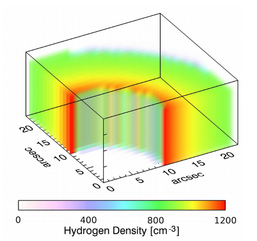
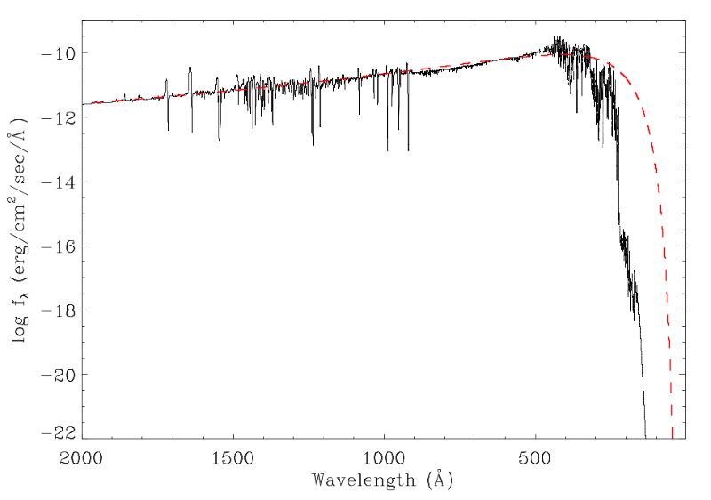

## MOCASSIN Models of the PN Abell 48

A photoionization model of the planetary nebula Abell 48 presented in ([Danehkar et al. 2014](http://adsabs.harvard.edu/abs/2014MNRAS.439.3605D)) 
was constructed using a inhomogeneous density model determined from IFU observations taken with the Wide-Field Spectrograph 
(WiFeS; [Dopita et al. 2007](http://adsabs.harvard.edu/abs/2007Ap%26SS.310..255D), [2010](http://adsabs.harvard.edu/abs/2010Ap%26SS.327..245D)) on the ANU 2.3-m 
Telescope at the Siding Spring Observatory. 

* The 3-D density distribution was a inhomogeneous powerlaw radial density model in the cylindrical coordinate system.

* The ionizing source was a hydrogen-deficient expanding model atmosphere from [Todt et al. (2013)](http://adsabs.harvard.edu/abs/2013MNRAS.430.2302T).

* MOCASSIN (version 2.02.67) and the CHIANTI atomic data (version 5.2).

### Reference

* Danehkar, A., Todt, H., Ercolano, B., & Kniazev, A.Y., "Observations and three-dimensional photoionization modelling of the Wolf-Rayet planetary nebula Abell 48", [MNRAS, 439, 3605, 2014](http://adsabs.harvard.edu/abs/2014MNRAS.439.3605D)
