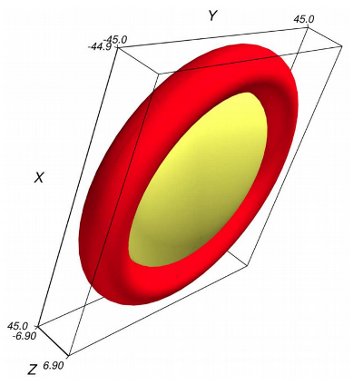
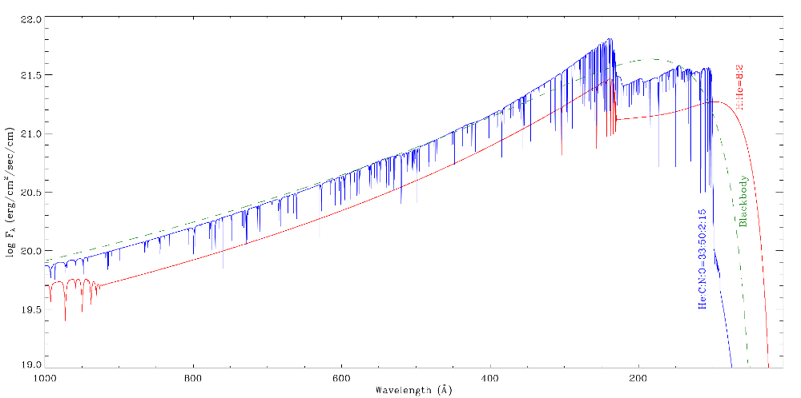

## MOCASSIN Models of the PN SuWt 2

Two photoionization models of the planetary nebula SuWt 2 presented in ([Danehkar et al. 2013](http://adsabs.harvard.edu/abs/2013MNRAS.434.1513D)) were constructed using 
the physical conditions determined from IFU observations taken with the Wide-Field Spectrograph 
(WiFeS; [Dopita et al. 2007](http://adsabs.harvard.edu/abs/2007Ap%26SS.310..255D), [2010](http://adsabs.harvard.edu/abs/2010Ap%26SS.327..245D)) on the ANU 2.3-m 
Telescope at the Siding Spring Observatory. 

* The 3-D density distribution was a bi-density model consisting of a dense torus (N=100 cm-3) and a tenuous oblate spheroid (N=50 cm-3). 

* The ionizing sources were H-rich and PG 1159-type NLTE model atmospheres obtained from the [NLTE 
Tuebingen Model-Atmosphere Fluxes Package](http://astro.uni-tuebingen.de/~rauch/TMAF/TMAF.html).

* MOCASSIN (version 2.02.67) and the CHIANTI atomic data (version 5.2).

### Reference

* Danehkar, A., Parker, Q. A., & Ercolano, B., "Observations and three-dimensional ionization structure of the planetary nebula SuWt 2", [MNRAS, 434, 1513, 2013](http://adsabs.harvard.edu/abs/2013MNRAS.434.1513D)
